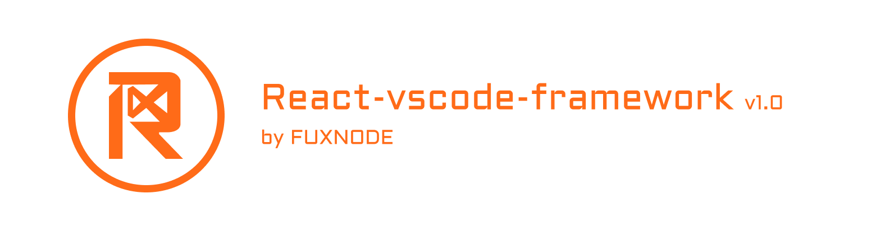

# react-vscode-cli

> *Introducing the React-based VSCode Extension Framework: a powerful tool for developers and designers looking to create custom VSCode extensions with ease.*

[twitter-shield]: https://img.shields.io/twitter/follow/fuxnode?style=social
[twitter-url]: https://twitter.com/fuxnode
[github-shield]: https://img.shields.io/github/stars/Fux-Node/react-vscode-framework?style=social
[github-url]: https://github.com/Fux-Node/react-vscode-framework.git
[youtube-shield]: https://img.shields.io/youtube/channel/views/UClqkweaAkQhKTJKWDS3Tlnw?style=social
[youtube-url]: https://www.youtube.com/UClqkweaAkQhKTJKWDS3Tlnw
[discord-shield]: https://dcbadge.vercel.app/api/server/hACSzssXYy?style=social
[discord-url]: https://discord.gg/hACSzssXYy

[![Github Repo][github-shield]][github-url]
[![Youtube][youtube-shield]][youtube-url]
[![Discord][discord-shield]][discord-url]
[![Twitter Follow][twitter-shield]][twitter-url]

****

# Description:

#### Built on the popular React JavaScript library, this framework provides an intuitive and flexible platform for creating dynamic and responsive extensions that seamlessly integrate with the VSCode ecosystem. With support for a wide range of VSCode APIs and functionality, including editor manipulation, language services, and debugging tools, the React-based VSCode Extension Framework offers an unparalleled level of control and customization. One of the key benefits of this framework is its user-friendly interface, which allows developers to quickly and easily create, edit, and deploy extensions with minimal coding experience required. The framework comes equipped with a range of pre-built components and templates, including UI elements, menus, and commands, that can be easily customized to meet your specific needs. In addition to its ease of use, the React-based VSCode Extension Framework also offers robust functionality and flexibility. It supports a wide range of React-based tools and libraries, including Redux, React Router, and CSS-in-JS, enabling developers to create complex, multi-functional extensions with ease. The framework is also highly modular, allowing you to easily add and remove components as needed, and providing a seamless integration with other VSCode extensions and tools. Whether you're a seasoned developer or just starting out, the React-based VSCode Extension Framework is a powerful and versatile tool for creating custom VSCode extensions that meet your specific needs. With its intuitive interface, robust functionality, and flexible architecture, this framework is sure to become a go-to tool for developers and designers looking to create high-quality, customized VSCode extensions.
****

# Get Started:

## How to Install ?

**Install react vscode cli globally on your system.**

    npm install -g react-vscode-cli

**Let's Create a project with react-vscode-cli.**

    npx react-vscode-cli projectname

**Now Install All Dependencies**

    cd projectname && npm install

**Now open that project on your visual studio code IDE**

    code .
    
> Once your project open in vscode then click on F5 or start debugging manually by navigating through Run > Start Debugging

# File Structure
## Commands:
        > src
           > commands
             > private
             > public
               index.ts

* **commands** folder created inside root folder **src**. there we have two folder private and public and one file index.ts . so if you want to show your command in publicly then you can write your functions inside public folder otherwise write this into private folder for a good practice. [Learn more](https://fuxnode.com/docs#Commands)

## Constants:
        > src
           > constants
             > assets
             > web

* **constants** folder created inside root folder **src**. there we have two folder assets and web. so I used assets only for vscode configuration image files and those images which we need on our webview side then we can add images in web folder. [Learn more](https://fuxnode.com/docs#Constants)

## Functions:
        > src
           > functions

* **functions** folder created inside root folder **src**. we can create our regular functions inside this folder. [Learn more](https://fuxnode.com/docs#Functions)

## Global:
        > src
           > global
             > middlewares
                > commands
                    > functions
                      index.ts
               vscode.ts

* **global** folder created inside root folder **src**. all essential functions and middleware functions created here. all functionalities mentioned in our docs so click on [Learn more](https://fuxnode.com/docs#Global)

## Interfaces:
        > src
           > interfaces

* **interfaces** folder created inside root folder **src**. we can create our regular types inside this folder. [Learn more](https://fuxnode.com/docs#Interfaces)

## Pages:
        > src
           > pages
             > apps
             > components
             > context
             > hooks
             > styles
               index.tsx

* **pages** folder created inside root folder **src**. **index.tsx** file is the entry file of react js all webview design proceeds on this folder. click on this for [Learn more](https://fuxnode.com/docs#Pages)

## Types:
        > src
           > types

* **types** folder created inside root folder **src**. we can writer our regular command names and id inside this folder. [Learn more](https://fuxnode.com/docs#Types)

## Views:
        > src
           > views
             > tree
               > data
                 index.ts
             > web
               > base
               > private
               > public
                 index.ts

* **views** folder created inside root folder **src**. we can writer our tree views inside tree folder by following index.ts file of tree and if you want to create web view you can follow index.ts of web. click on this for [Learn more](https://fuxnode.com/docs#Views)

## License

Copyright (c) 2023 FUXNODE. Licensed under MIT license, see [LICENSE](LICENSE) for the full license.